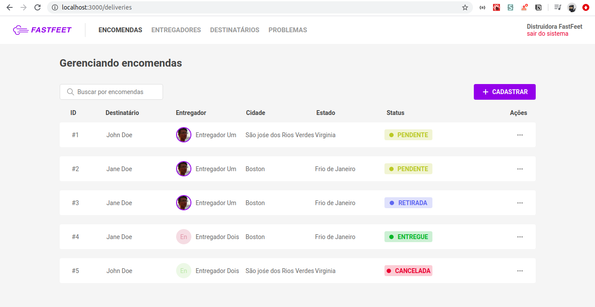

# FastFeet
Projeto final do Bootcamp da Rocketseat: um sistema para conectar entregadores e destinatários.

### Preview



## Algumas considerações
Sim, de fato não fiz a parte mobile (ainda vou fazer depois). Me enrolei na minha organização. Não pretendo mais fazer esse projeto pra pegar o certificado, é mais pra receber o _feedback_ de vocês quanto à organização e "egenharia" do código, design e etc. E tirar umas dúvidas também.

As dúvidas estão nessa [página](https://www.notion.so/Rocketseat-8f694e501ee243098a75e86663472ce9) do Notion. Por favor, leia com atenção kkk.

## Backend

### Setup
Abra o diretório `backend` no terminal e execute:
```
yarn
# ou
npm install
```

Outros programas:

* [Insomnia](https://insomnia.rest/) cliente de requisições HTTP para testar o backend.
* [Postbird](https://www.electronjs.org/apps/postbird) (ou qualquer outro cliente
Postgres) para visualizar o banco de dados.
* [Docker](https://www.docker.com/) para montar a imagem do banco de dados.

#### Variáveis ambiente
Duplique o arquivo `.env.example` e renomeie para `.env`. Então preencha as variáveis
de acordo com as suas informações.

Com [Docker](https://www.docker.com/products/docker-desktop) instalado é fácil criar uma imagem de banco de dados Postgres. Basta executar no terminal 

```sh
# subir uma imagem do Postgres
docker run --name pg_fastfeet -e POSTGRES_PASSWORD=docker -p 5432:5432 -d postgres:11

# subir uma imagem do Redis
docker run --name redis_fasfeet -p 6379:6379 -d -t redis:alpine
```

Lembrando que a senha (`POSTGRES_PASSWORD`) do comando anterior deve ser a mesma que está em `DB_PASS` no arquivo `.env`.

Abra o seu cliente Postgres (Postbird, por exemplo) e crie um banco de dados com o mesmo nome que você colocou pra `DB_NAME` no arquivo `.env`.


#### Preenchendo o Banco de Dados
Não se esqueça de iniciar os bancos de dados Postgres e Redis.
Para criar as tabelas do banco de dados e preenchê-las, execute

```sh
yarn db:populate
```

### Executar
Para iniciar o backend

```sh
yarn dev
# em outra janela de terminal
yarn queue
```


### Workspace do Insomnia
[](https://insomnia.rest/run/?label=Fasfeet&uri=https%3A%2F%2Fraw.githubusercontent.com%2Fyudi-azvd%2Ffastfeet-backend%2Fmaster%2FInsomnia-fastfeet.json)

## Frontend

### Instalação
Abra o terminal no diretório `frontend` e execute:

```sh
yarn 
yarn start
```

Inicialmente os entregadores não possuem fotos. Você pode adicionar um avtar clicando na "aba" de ENTREGADORES e clicando no avatar para selecionar uma foto no seu computador.
